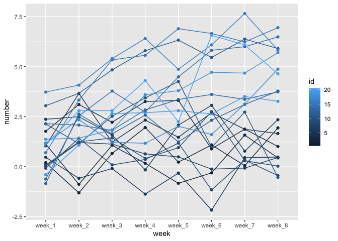

HW 5
================
QiLu
11/9/2019

### Problem 1

``` r
library(tidyverse)
```

    ## ── Attaching packages ─────────────────────────────────────────── tidyverse 1.2.1 ──

    ## ✔ ggplot2 3.2.1     ✔ purrr   0.3.2
    ## ✔ tibble  2.1.3     ✔ dplyr   0.8.3
    ## ✔ tidyr   1.0.0     ✔ stringr 1.4.0
    ## ✔ readr   1.3.1     ✔ forcats 0.4.0

    ## ── Conflicts ────────────────────────────────────────────── tidyverse_conflicts() ──
    ## ✖ dplyr::filter() masks stats::filter()
    ## ✖ dplyr::lag()    masks stats::lag()

``` r
library(readr)
library(dplyr)

set.seed(10)

iris_with_missing = iris %>% 
  map_df(~replace(.x, sample(1:150, 20), NA)) %>%
  mutate(Species = as.character(Species))
```

output = vector(“list”, length = 4)

``` r
fill_in = function(x) {

  if (is.numeric(x)){
    x_changed = x %>% replace_na(mean(x, na.rm=TRUE))
}
  else if(is.character(x)){
  x_changed = replace_na(x,"virginica")
 
  }
  
  tibble(x_changed)
}
```

``` r
output = vector("list", length = 5)
output = bind_cols(map(iris_with_missing, fill_in))
output
```

    ## # A tibble: 150 x 5
    ##    x_changed x_changed1 x_changed2 x_changed3 x_changed4
    ##        <dbl>      <dbl>      <dbl>      <dbl> <chr>     
    ##  1      5.1         3.5       1.4        0.2  setosa    
    ##  2      4.9         3         1.4        0.2  setosa    
    ##  3      4.7         3.2       1.3        0.2  setosa    
    ##  4      4.6         3.1       1.5        1.19 setosa    
    ##  5      5           3.6       1.4        0.2  setosa    
    ##  6      5.4         3.9       1.7        0.4  setosa    
    ##  7      5.82        3.4       1.4        0.3  setosa    
    ##  8      5           3.4       1.5        0.2  setosa    
    ##  9      4.4         2.9       1.4        0.2  setosa    
    ## 10      4.9         3.1       3.77       0.1  setosa    
    ## # … with 140 more rows

### Problem 2

``` r
data_import = list.files(pattern="*.csv", recursive = TRUE) %>% 
  purrr::map(~read_csv(.)) %>% 
  bind_rows(.id = "id")
data_import$con_exp = "exp"
data_import$id = as.numeric(data_import$id)


data_import$con_exp = replace(data_import$con_exp, data_import$id < 11, "con")

data_import_plot = pivot_longer(data_import,week_1:week_8,names_to = "week", values_to = "number") %>% 
  group_by(id,week)
```

``` r
data_import_plot %>% 
ggplot(aes(x = week, y = number, group = id, color = id)) +
  geom_point() + geom_line(aes(color = id))
```

<!-- -->

The difference between control arm and experimental increase by weeks.
