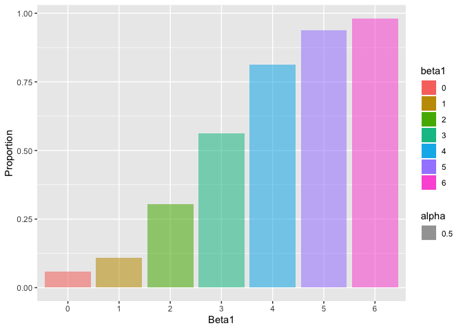

HW 5
================
QiLu
11/9/2019

### Problem 1

``` r
library(tidyverse)
```

    ## ── Attaching packages ─────────────────────────────────────────── tidyverse 1.2.1 ──

    ## ✔ ggplot2 3.2.1     ✔ purrr   0.3.2
    ## ✔ tibble  2.1.3     ✔ dplyr   0.8.3
    ## ✔ tidyr   1.0.0     ✔ stringr 1.4.0
    ## ✔ readr   1.3.1     ✔ forcats 0.4.0

    ## ── Conflicts ────────────────────────────────────────────── tidyverse_conflicts() ──
    ## ✖ dplyr::filter() masks stats::filter()
    ## ✖ dplyr::lag()    masks stats::lag()

``` r
library(readr)
library(dplyr)
library(rvest)
```

    ## Loading required package: xml2

    ## 
    ## Attaching package: 'rvest'

    ## The following object is masked from 'package:purrr':
    ## 
    ##     pluck

    ## The following object is masked from 'package:readr':
    ## 
    ##     guess_encoding

``` r
set.seed(10)

iris_with_missing = iris %>% 
  map_df(~replace(.x, sample(1:150, 20), NA)) %>%
  mutate(Species = as.character(Species))
```

output = vector(“list”, length = 4)

``` r
fill_in = function(x) {

  if (is.numeric(x)){
    x_changed = x %>% replace_na(mean(x, na.rm=TRUE))
}
  else if(is.character(x)){
  x_changed = replace_na(x,"virginica")
 
  }
  
  tibble(x_changed)
}
```

``` r
output = vector("list", length = 5)
output = bind_cols(map(iris_with_missing, fill_in))
output
```

    ## # A tibble: 150 x 5
    ##    x_changed x_changed1 x_changed2 x_changed3 x_changed4
    ##        <dbl>      <dbl>      <dbl>      <dbl> <chr>     
    ##  1      5.1         3.5       1.4        0.2  setosa    
    ##  2      4.9         3         1.4        0.2  setosa    
    ##  3      4.7         3.2       1.3        0.2  setosa    
    ##  4      4.6         3.1       1.5        1.19 setosa    
    ##  5      5           3.6       1.4        0.2  setosa    
    ##  6      5.4         3.9       1.7        0.4  setosa    
    ##  7      5.82        3.4       1.4        0.3  setosa    
    ##  8      5           3.4       1.5        0.2  setosa    
    ##  9      4.4         2.9       1.4        0.2  setosa    
    ## 10      4.9         3.1       3.77       0.1  setosa    
    ## # … with 140 more rows

### Problem 2

``` r
data_import = list.files(pattern="*.csv", recursive = TRUE) %>% 
  purrr::map(~read_csv(.)) %>% 
  bind_rows(.id = "id")
data_import$con_exp = "exp"
data_import$id = as.numeric(data_import$id)


data_import$con_exp = replace(data_import$con_exp, data_import$id < 11, "con")

data_import_plot = pivot_longer(data_import,week_1:week_8,names_to = "week", values_to = "number") %>% 
  group_by(id,week)
```

``` r
data_import_plot %>% 
ggplot(aes(x = week, y = number, group = id, color = id)) +
  geom_point() + geom_line(aes(color = id))
```

<!-- -->

The difference between control arm and experimental is slightly. In
addition, experimental arm increased as the week increased.

### Problem 3

``` r
sim_regression = function(n = 1000, beta0 = 2, beta1 = 0) {
  
  sim_data = tibble(
    x = rnorm(n, mean = 0, sd = 1),
    y = beta0 + beta1 * x + rnorm(n, 0, sqrt(50))
  )
  
  ls_fit = lm(y ~ x, data = sim_data)
  
  broom::tidy(ls_fit) %>%
    filter(term == "x") %>%
    select(estimate, p.value)

}
```

``` r
output_0 = rerun(1000, sim_regression(n = 30)) %>% 
  bind_rows()

output_0
```

    ## # A tibble: 1,000 x 2
    ##    estimate  p.value
    ##       <dbl>    <dbl>
    ##  1    2.02  0.207   
    ##  2    1.23  0.182   
    ##  3    0.603 0.606   
    ##  4    3.03  0.000149
    ##  5   -1.19  0.471   
    ##  6   -1.49  0.219   
    ##  7   -1.97  0.192   
    ##  8    0.331 0.769   
    ##  9    0.576 0.670   
    ## 10    2.40  0.134   
    ## # … with 990 more rows

For plot
part

``` r
sim_output =  map_df(.x = 0:6, ~ rerun(1000, sim_regression(n = 30, beta1 = .x) %>% 
          mutate(beta1 = .x)) %>% 
          bind_rows()
)

sim_plot = sim_output %>%
  mutate(
    reject = ifelse(p.value < 0.05, 1, 0)
  ) %>%
  group_by(beta1) %>%
  summarize(propor = mean(reject)) 

sim_plot$beta1 = as.factor(sim_plot$beta1)
```

``` r
ggplot(sim_plot, aes(x = beta1, y = propor, fill = beta1, alpha = 0.5)) +
  geom_histogram(stat = "identity") +
  labs(
    x = "Beta1",
    y = "Proportion"
  )
```

    ## Warning: Ignoring unknown parameters: binwidth, bins, pad

<!-- -->

As we can see from the graph, beta1 is postive correlation to
proportion, that is to say, the effect size is proportional to power.

``` r
sim_mean = sim_output %>%
  group_by(beta1) %>%
  summarize(est_mean = mean(estimate)) %>%
  mutate(
    ind = "all"
  )
sim_mean$beta1 = as.factor(sim_mean$beta1)
```

``` r
sim_rejected_mean <- sim_output %>%
  filter(p.value < 0.05) %>%
  group_by(beta1) %>%
  summarize(est_mean = mean(estimate)) %>%
  mutate(
    ind = "rejected"
  )
sim_rejected_mean$beta1 = as.factor(sim_rejected_mean$beta1)
```

``` r
plot_data = bind_rows(sim_mean, sim_rejected_mean)

ggplot(plot_data, aes(x = beta1, y = est_mean, group = ind, color = ind)) +
  geom_point() + geom_line() +
  labs(
    x = "True Beta1",
    y = "Average of Estimated Beta1"
  )
```

<!-- -->

Overall, the average of estimated beta1 has no big difference with the
true mean. Because the lager the sample size, the solid the normality.
Therefore, the estimated beta1 is closer to the true mean.
